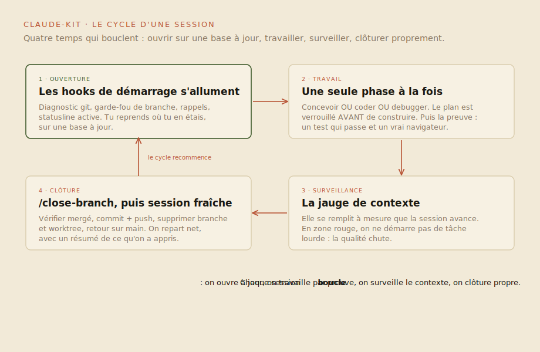
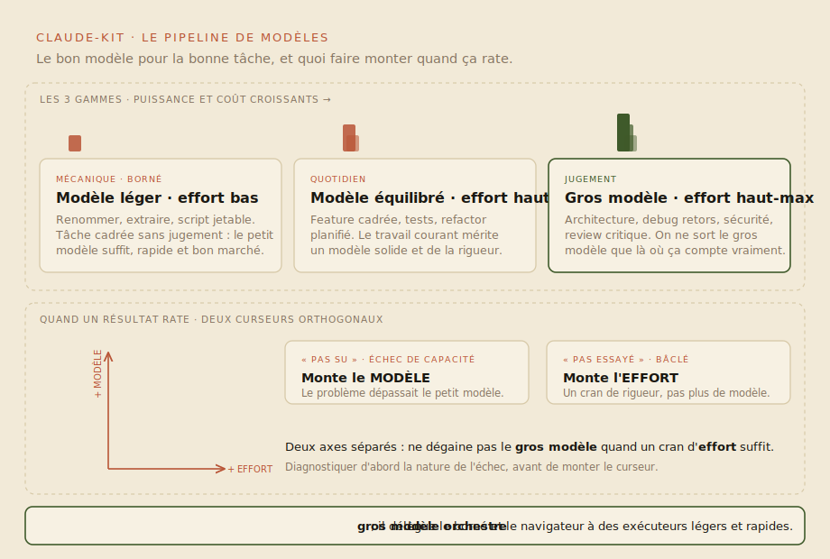

# claude-kit

**Pas besoin d'être développeur pour produire du bon logiciel avec un agent. Il faut une méthode. Ce kit est cette méthode, plus la configuration qui la fait respecter automatiquement.**

Une config Claude Code complète et un playbook, prêts à installer. Ce repo condense plusieurs années de pratique intensive des agents IA : comment les piloter, obtenir du code fiable sans lire chaque ligne, et éviter les pièges classiques (contexte qui pourrit, vérifications bâclées, interfaces génériques, budgets tokens explosés). Tout est en français, tout est actionnable.


## Pour qui

- **Débutant total** (tu découvres Claude Code) : tu pars avec des rails solides au lieu d'une page blanche.
- **Utilisateur déjà actif** : tu piocheras les hooks, agents et chapitres qui manquent à ta config.

## Démarre en 3 minutes

Clone le repo et lance l'installeur :

```bash
git clone https://github.com/VincentBlanchon/claude-kit.git
cd claude-kit
./install.sh
```

L'installation est **non-destructive** : elle n'écrase jamais un fichier existant (elle le signale et te laisse décider). Options : `./install.sh --dry-run` pour voir ce qui serait fait, `./install.sh --force` pour tout écraser en connaissance de cause.

Ensuite, ton tout premier geste :

```bash
claude
```

Puis lis [GUIDE-DEMARRAGE.md](GUIDE-DEMARRAGE.md). Il te fait passer de zéro (installer Claude Code, comprendre les trois étages du kit, lancer ton premier projet) à autonome, en 20 minutes.

## Le système en un regard

Trois schémas suffisent à voir comment tout tient ensemble.



*Une session, de l'ouverture (hooks de démarrage, jauge de contexte) à la clôture propre avec `/close-branch`, puis on repart frais. Une phase à la fois, un plan verrouillé avant de construire, une preuve avant de dire que c'est fait.*



*Trois gammes de modèles selon la charge (léger pour le borné, équilibré au quotidien, gros pour le jugement), avec l'effort réglé haut par défaut. Quand un résultat rate : "pas su" fait monter le modèle, "pas essayé" fait monter l'effort.*

Les [9 schémas détaillés](playbook/schemas.md) montrent ensuite chaque moment précis : ce qui se charge à l'ouverture, ce qu'un hook bloque, comment la preuve est exigée, comment une correction devient un pattern permanent.

## Parcours guidé : de zéro à autonome

Un chemin à suivre dans l'ordre. Chaque étape prépare la suivante.

1. **Lis [GUIDE-DEMARRAGE.md](GUIDE-DEMARRAGE.md).** Le point d'entrée : installer, comprendre les trois étages, ton premier projet.
2. **Installe le kit** (voir plus haut), puis relance `./install.sh` après chaque `git pull`.
3. **Comprends ton rôle** avec [01 - La philosophie du builder](playbook/01-philosophie-builder.md) : ce que tu décides, cadres et vérifies quand c'est l'agent qui écrit le code.
4. **Soigne ton `CLAUDE.md`** avec [02 - L'art du CLAUDE.md](playbook/02-claude-md.md) : le fichier le plus rentable de ton setup.
5. **Adopte le workflow feature** avec [03](playbook/03-workflow-feature.md) et [04](playbook/04-verification.md) : comprendre, planifier, verrouiller, construire, prouver, livrer.
6. **Garde l'agent lucide** avec [05 - Contexte et mémoire](playbook/05-contexte-et-memoire.md) : pourquoi les sessions se dégradent et quoi faire à chaque seuil.
7. **Muscle ta config** avec [06 - Skills, agents, MCP](playbook/06-skills-agents-mcp.md) et [07 - Hooks et sécurité](playbook/07-hooks-et-securite.md) : l'enforcement qui ne dépend plus de la bonne volonté.
8. **Finis proprement** avec [08 - La discipline git](playbook/08-git-discipline.md), [09 - Du front sans slop](playbook/09-front-sans-slop.md) et [10 - Modèles et coûts](playbook/10-modeles-et-couts.md).

À la fin de ce parcours, tu pilotes un agent sans lire son code, en sachant exactement quand lui faire confiance et quand exiger une preuve.

## Ce qu'il y a dedans

| Dossier | Contenu | Installé vers |
|---|---|---|
| [playbook/](playbook/README.md) | La méthode en 10 chapitres + [9 schémas mermaid](playbook/schemas.md) qui montrent précisément ce qui se passe sous le capot | (lecture, pas installé) |
| [config/](config/) | `CLAUDE.md` global de départ, `settings.json` de base (secrets bloqués), 5 règles toujours chargées | `~/.claude/` |
| [skills/](skills/) | `demarrer-projet` (initialisation guidée), `designsense` (692 règles UI/UX anti-générique), `take-your-time` (réflexion produit avant le code), `patterns` (conventions inter-projets) | `~/.claude/skills/` |
| [agents/](agents/) | 6 sous-agents spécialisés en lecture seule : architecte, QA, reviewer design, auditeur sécurité, conseiller stack, roadmap | `~/.claude/agents/` |
| [hooks/](hooks/) | 12 scripts d'enforcement : diagnostic git à l'ouverture (retard, branches fantômes, worktrees oubliés), garde-fou de branche, statusline (jauge de contexte réelle), lint/format après édition, blocage `--no-verify`, commandes destructives et panneau preview intégré, typecheck à l'arrêt, directive de compaction, alerte anti-slop front, apprentissage continu | `~/.claude/hooks/` |
| [templates/](templates/) | `CLAUDE.md` projet, `settings.json` projet, template d'agent | (copiés par `demarrer-projet`) |

## La philosophie en 5 points

1. **Réfléchir avant de coder.** Les hypothèses se disent à voix haute, les ambiguïtés se lèvent avant, pas pendant. Un plan validé, puis on construit.
2. **La simplicité d'abord.** Le minimum de code qui résout le problème. Rien de spéculatif, pas d'abstraction pour un usage unique.
3. **La preuve ou rien.** « C'est fait » sans test qui passe et sans vérification dans un vrai navigateur, ça n'existe pas. Le playbook fournit la checklist.
4. **L'enforcement bat la consigne.** Une règle écrite dans un fichier peut être oubliée sous pression ; un hook ou une permission `deny` ne peut pas. Ce kit installe les deux.
5. **Le système compte plus que le modèle.** Une bonne config, des règles courtes, une mémoire bien tenue et des vérifications systématiques produisent plus que n'importe quel changement de modèle.

## Structure après installation

```
~/.claude/
├── CLAUDE.md          ← règles globales (comportement de l'agent, tous projets)
├── settings.json      ← permissions (secrets bloqués) + hooks câblés
├── rules/             ← 5 règles courtes toujours chargées
├── skills/            ← workflows invocables (/demarrer-projet, designsense…)
├── agents/            ← sous-agents spécialisés (relecture, audit, plan)
├── hooks/             ← scripts d'enforcement (lint, typecheck, git)
└── patterns/          ← tes conventions personnelles (vide au départ, à toi de le remplir)
```

## Pour aller plus loin

Tout le détail, les sources et les cas limites vivent dans le [playbook](playbook/README.md). Commence par le [guide de démarrage](GUIDE-DEMARRAGE.md), puis suis les chapitres dans l'ordre.

## Maintenu par

Vincent Blanchon. Ce kit est la version partageable de ma configuration personnelle : tout ce qui est ici est générique et testé en conditions réelles sur une quinzaine de projets (produits web, pipelines de données, automatisations, apps mobiles).

Licence [MIT](LICENSE) : sers-toi, adapte, partage.
</content>
</invoke>
