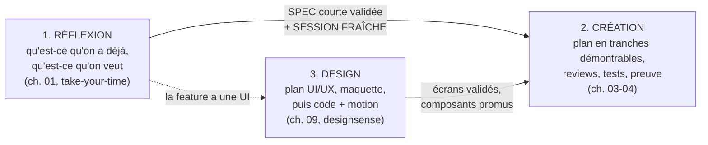

# Le playbook

La méthode complète pour travailler avec des agents IA, en 10 chapitres courts. Chaque chapitre est autonome, mais l'ordre est pensé : les premiers posent le rôle et les fondations, les suivants outillent le quotidien.

| # | Chapitre | En une phrase |
|---|---|---|
| 01 | [La philosophie du builder](01-philosophie-builder.md) | Ton rôle exact quand l'agent écrit le code : décider, cadrer, vérifier |
| 02 | [L'art du CLAUDE.md](02-claude-md.md) | Le fichier le plus rentable de ton setup : quoi y mettre, quoi bannir |
| 03 | [Le workflow feature](03-workflow-feature.md) | Comprendre, planifier, verrouiller, construire, vérifier, livrer |
| 04 | [La vérification](04-verification.md) | « C'est fait » ne vaut rien sans preuve : la checklist complète |
| 05 | [Contexte et mémoire](05-contexte-et-memoire.md) | Pourquoi les sessions se dégradent et comment garder un agent lucide |
| 06 | [Skills, agents, MCP](06-skills-agents-mcp.md) | Trois outils différents : enseigner, déléguer, donner accès |
| 07 | [Hooks et sécurité](07-hooks-et-securite.md) | L'enforcement automatique : ce qui ne dépend plus de la bonne volonté |
| 08 | [La discipline git](08-git-discipline.md) | Branches, PR courtes, et l'hygiène qui évite les états fantômes |
| 09 | [Du front sans slop](09-front-sans-slop.md) | La méthode pour des interfaces qui ne sentent pas l'IA |
| 10 | [Modèles et coûts](10-modeles-et-couts.md) | Choisir le bon modèle et le bon effort, tenir un budget tokens |
| ★ | [Sous le capot : les schémas](schemas.md) | Les 9 schémas mermaid qui montrent précisément ce qui se passe : chargement, blocages, gates, hooks, apprentissage |

## Les 3 pipelines (la carte mentale)

Tout le travail avec un agent passe par trois pipelines, avec des passages de témoin nets :

Les deux règles de frontière qui changent tout : la **réflexion ne code jamais** (elle produit une SPEC courte : besoin, scope, hors-scope, critères ; la construction démarre dans une session NEUVE qui charge la SPEC et rien d'autre, donc zéro contexte pollué) ; et le **design ne se mélange jamais à la création** dans une même conversation (le design livre des écrans validés, la création les branche).

## D'où ça vient

Ces chapitres distillent trois sources : la documentation et les guides officiels Anthropic, une veille continue sur les retours d'expérience publics (praticiens, équipes en production), et la pratique réelle sur une quinzaine de projets (produits web, pipelines de données, automatisations, apps mobiles). Quand un chiffre est cité, il vient d'une source publique documentée ; quand une règle est affirmée, elle a été éprouvée en conditions réelles.

## Comment le lire

- **Tu débutes** : dans l'ordre, un chapitre par jour, en appliquant au fur et à mesure.
- **Tu pratiques déjà** : va directement aux chapitres 04 (vérification), 07 (enforcement) et 10 (coûts), ce sont les trois où l'écart entre pratique moyenne et bonne pratique est le plus grand.
