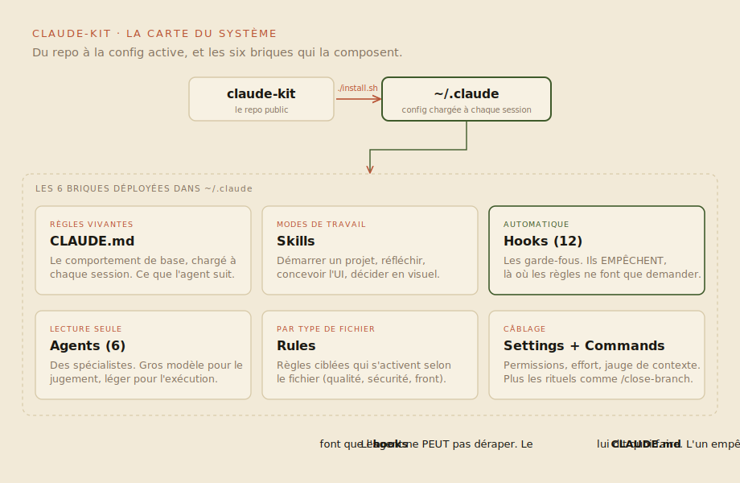
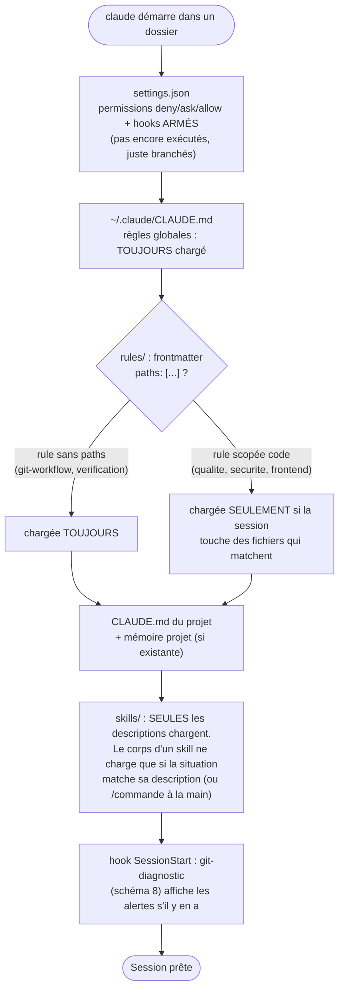
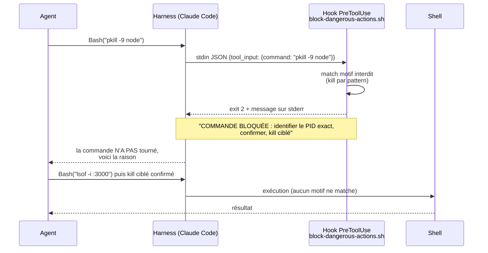
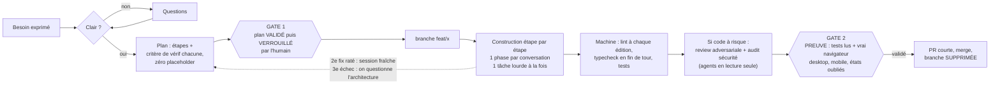
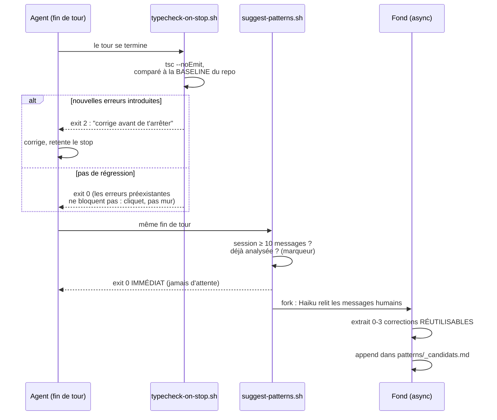
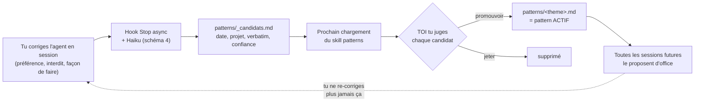
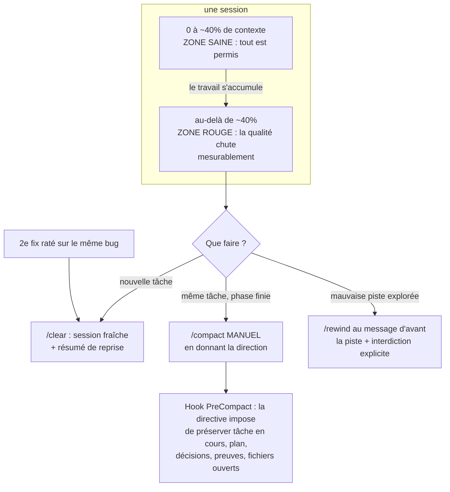
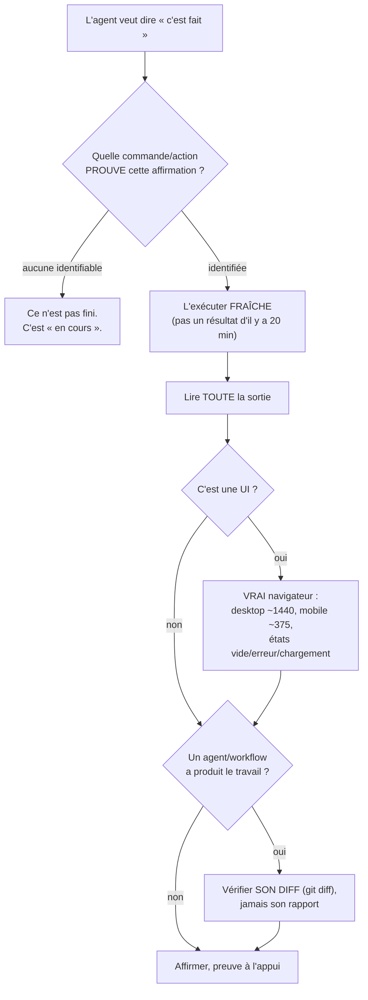
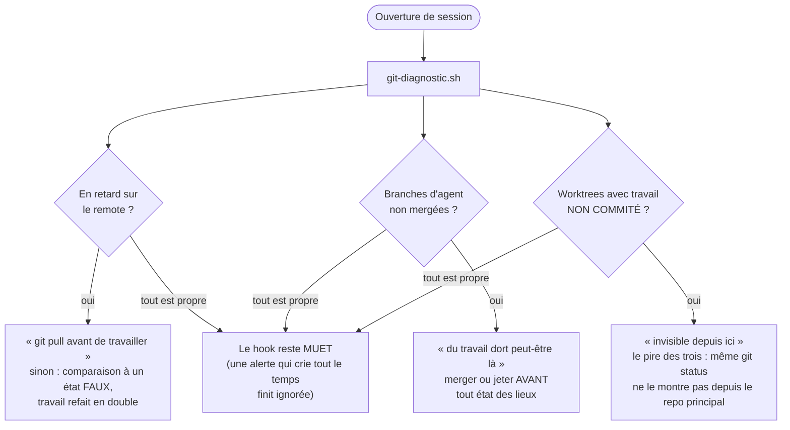
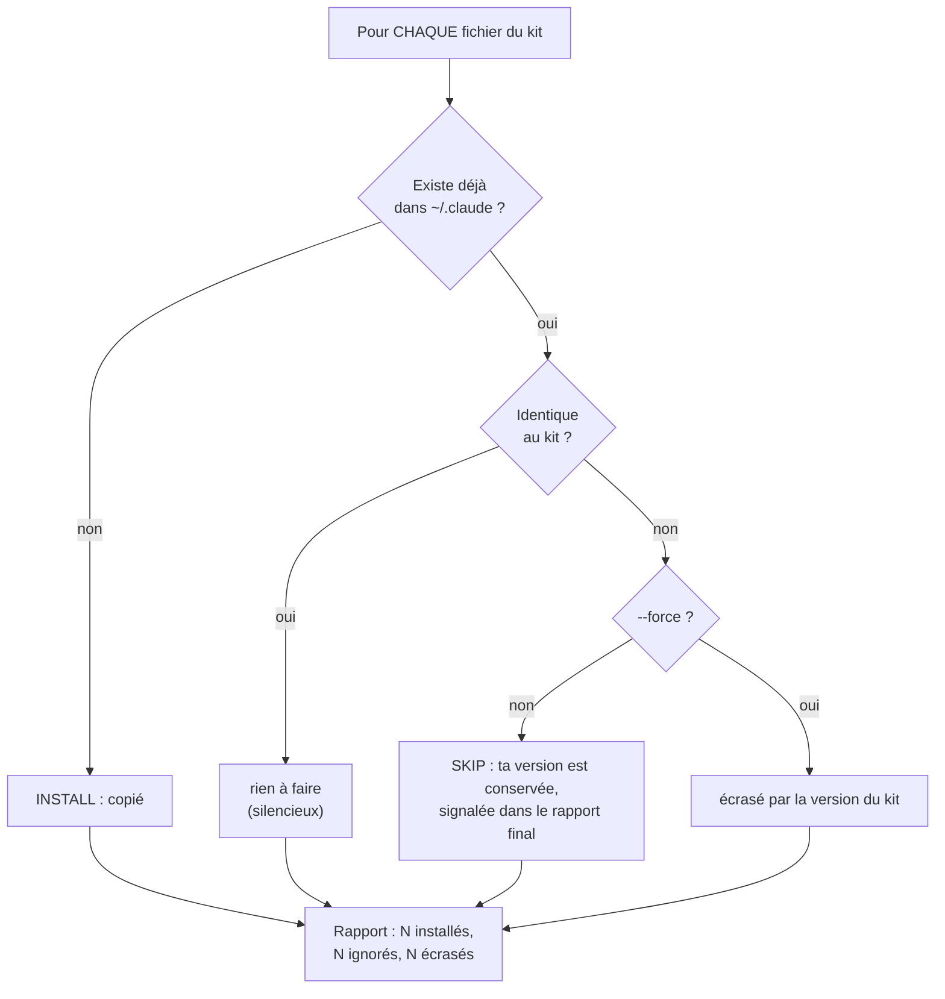

# Sous le capot : le système en schémas

Une carte d'ensemble d'abord, puis neuf schémas qui montrent PRÉCISÉMENT ce qui se passe à chaque moment : ce qui se charge, ce qui bloque, ce qui vérifie, ce qui apprend. À lire avec le [playbook](README.md) ; chaque schéma renvoie au chapitre qui l'explique.

## Vue d'ensemble : la carte du système

Le repo s'installe dans `~/.claude` via `./install.sh`, qui déploie six briques chargées à chaque session. Les hooks empêchent (automatique, déterministe), le CLAUDE.md guide (règles à suivre). Les neuf schémas ci-dessous détaillent chaque moment.

## 1. Ce qui se charge à l'ouverture d'une session

Tout ne charge pas tout le temps : c'est ce qui garde les sessions rapides et le budget sous contrôle (chapitre [10](10-modeles-et-couts.md)).

Conséquence pratique : une règle mal placée (tout dans le CLAUDE.md global) coûte des tokens à CHAQUE message de CHAQUE session. Une règle scopée ou un skill ne coûtent que quand ils servent.

## 2. Une commande dangereuse est tentée

Le chapitre [07](07-hooks-et-securite.md) explique pourquoi l'enforcement bat la consigne. Voici la mécanique exacte :

Le point clé : l'agent ne peut pas « oublier » cette règle, elle ne vit pas dans sa mémoire mais dans le système. Même chose pour `--no-verify`, le force push, `git clean -f`, le SQL destructif via client DB, et la lecture des fichiers de secrets (bloquée encore plus tôt, par les permissions).

## 3. Le cycle d'une feature, avec les deux points de contrôle

Le chapitre [03](03-workflow-feature.md) en prose ; ici le circuit :

## 4. Ce qui se passe à CHAQUE fin de tour (hooks Stop)

Deux hooks tournent quand l'agent termine, avec deux philosophies différentes : l'un peut bloquer, l'autre ne bloque jamais.

## 5. La boucle d'apprentissage : de la correction au pattern permanent

La suite du schéma 4 : ce que deviennent les candidats (chapitre [05](05-contexte-et-memoire.md) pour la philosophie mémoire).

La règle absolue : **rien ne devient un pattern actif sans validation humaine**. Une mémoire qui s'écrit toute seule accumule du faux avec l'autorité du vrai.

## 6. La discipline de contexte, chiffrée

Pourquoi les sessions se dégradent et quoi faire à chaque seuil (chapitre [05](05-contexte-et-memoire.md)) :

## 7. « C'est fait » : l'arbre de la preuve

La règle du chapitre [04](04-verification.md), en logique exécutable :

## 8. L'ouverture de session côté git : les trois détections

Le hook `git-diagnostic.sh` (chapitre [08](08-git-discipline.md)) attrape les trois façons dont du travail se perd :

## 9. L'installeur : pourquoi il ne peut rien casser

`./install.sh` (voir [README](../README.md)) applique la même décision à chaque fichier :

C'est ce qui rend le kit installable sur une machine déjà configurée : par défaut, il complète, il n'écrase jamais.

---

*Si un schéma ne correspond plus au comportement réel du kit, c'est un bug de documentation : ouvre une issue ou corrige le schéma.*
